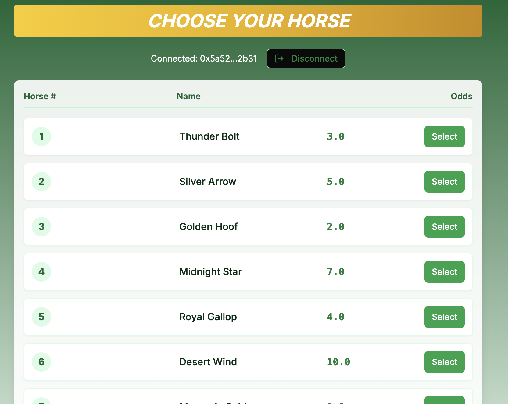
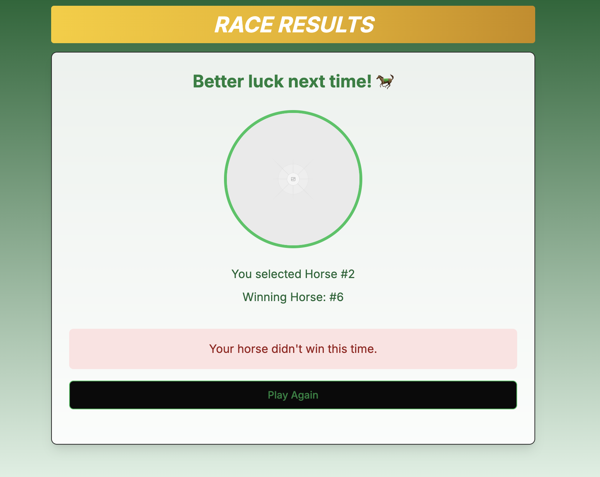

# Solana Horse Racing DApp

A decentralized betting app built on the Solana blockchain where you can bet on your favorite horse and experience the thrill — all on-chain.

---

## 🚀 Getting Started

Follow these steps to install dependencies and start the development server:

### 1. Install dependencies

```bash
npm install --legacy-peer-deps
```

### 2. Start the development server

```bash
npm run dev
```

The app will be available at http://localhost:3000.


### Screenshots



